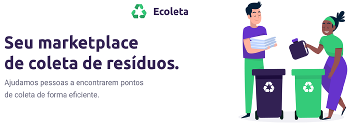

<h1 align="center">
    
</h1>

<p align="center">

  

  <a href="https://www.linkedin.com/in/veloso-lucas/">
    
  </a>

  

  

</p>

<p align="center">
  <a href="#-About-The-Project">About The Project</a>&nbsp;&nbsp;&nbsp;|&nbsp;&nbsp;&nbsp;
  <a href="#Technologies">Technologies</a>&nbsp;&nbsp;&nbsp;|&nbsp;&nbsp;&nbsp;
  <a href="#construction-%EF%B8%8F-layouts-construction">Layouts</a>&nbsp;&nbsp;&nbsp;|&nbsp;&nbsp;&nbsp;
  <a href="#information_source-how-to-use">How to use</a>&nbsp;&nbsp;&nbsp;
</p>


## 💻 About The Project

  Taking advantage of the environment week and as the environment is something essential for all of us, this project, Ecoleta, was created to be able to bring
  people with organizations or companies that carry out waste collection that is more harmful to the environment, such as batteries, cooking oil, etc.

<h1 align="center">
    
</h1>


## Technologies

This project was developed with the following technologies:

- [Node.js][node]
- [TypeScript][ts]
- [React][react]
- [React Native][reactnative]


## :information_source: How To Use 

To run this project make sure you have install :[Git](https://git-scm.com), [Node.js][node]

On the command line:

### To run the API

```bash
# Use the command below to clone this repository
$ git clone https://github.com/Velosofurioso/NLW-1.0-Ecoleta.git

# Inside the project go to the root of the backend folder
$ cd NLW-1.0-Ecoleta/Backend

# Install the necessary dependencies for the project 
$ npm install

# Install the necessary dependencies for the project 
$ npm install

# Install the necessary dependencies for the project 
$ npm install

# To create sqlite tables run
$ npm run knex:migrate

# To create sqlite tables run
$ npm run knex:migrate

# Create the seeds
$ npm run knex:seed

# With the settings made, run the API
$ npm dev

```

*OBS. 
If you run the mobile project, if possible, I recommend that you run it using virtualization on your pc, because if it runs directly on your cell phone, you will need to change the address being used for the API to make the requests in the project to your computer's ip address.

### To run the Frontend

```bash
#Inside the project, go to the frontend folder root
$ cd NLW-1.0-Ecoleta/frontend

#Use the command
$ npm start

```

Proudly developed by [Lucas Veloso](https://www.linkedin.com/in/veloso-lucas/)

[node]: https://nodejs.org/
[ts]: https://www.typescriptlang.org/
[react]: https://reactjs.org
[reactnative]: https://facebook.github.io/react-native/
